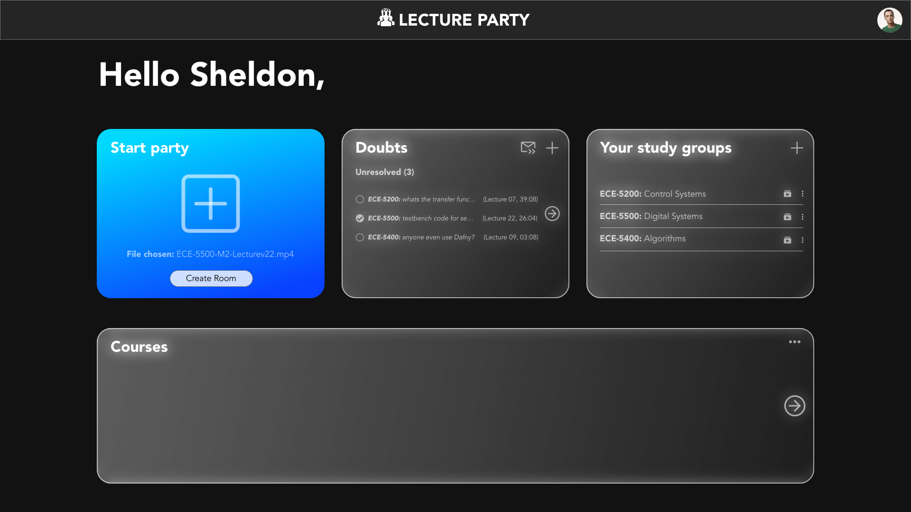

# HackFrost_NL
Competed in a weekend long hackathon even in a two member team. My team DotPy Was placed in the top 5 teams out of 33 participating teams.
# Problem Statement
The COVID-19 pandemic has negatively affected many industries like tourism, education, hospitality, retail etc. Implement a solution that helps to revive one of the industries affected by COVID-19.
# Solution
Our solution was a web application called "Lecture Party" that allows students to easily host group study sessions to view asynchronous university lectures in an interactive environment. 

Inline-style: 

Format: 
